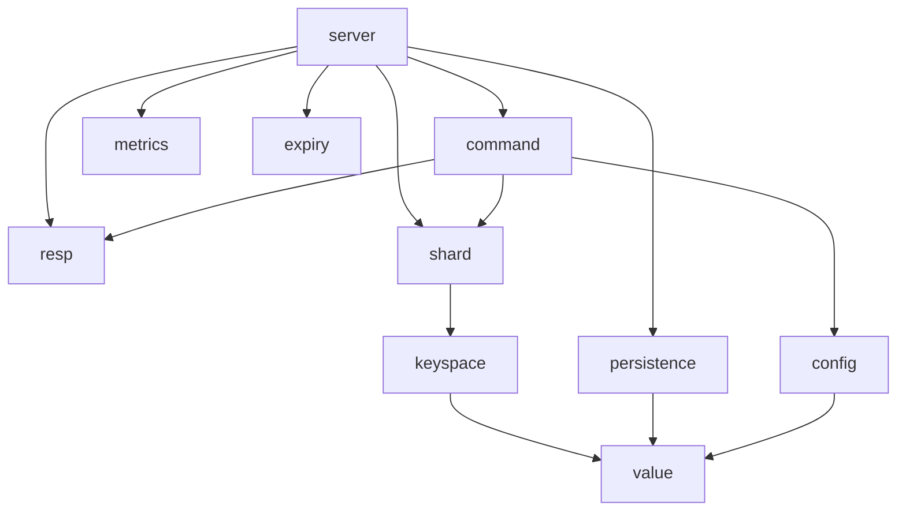

# Architecture

Memcore is a single Go binary. This document describes how its packages fit
together, the rules that keep them decoupled, and the three design decisions that
define the engine: keyspace sharding, compact collection encodings, and
fork-free persistence.

## Package layout

```
cmd/memcored        composition root: parse config, build the graph, run, shut down
internal/
  config            typed configuration, loaded once; live-reloadable subset
  clock             Clock interface; SystemClock and a deterministic ManualClock
  value             Value tagged union and the collection types
  keyspace          per-shard key to entry map with lazy expiry
  shard             one database split into hash-routed, independently locked shards
  expiry            background active expiry with a bounded per-cycle budget
  command           command table; handlers are pure functions over a Context
  resp              RESP2 reader, writer, and the Reply tagged type
  persistence       append log, snapshots, and recovery
  metrics           Prometheus collectors and the metrics HTTP server
  server            listener, connections, and the only package that touches sockets
```

## The inward-dependency rule

Dependencies point inward, toward the data. The storage core (`value`,
`keyspace`, `shard`) imports nothing from networking, protocol, or persistence.
`command` depends on the core and on `resp` for its reply type, but not on
`server`. `server` sits at the outside and is the only package aware of all the
others; it is also the only package that imports `net`.



Two rules fall out of this and are what reviewers are asked to protect:

- The core packages take an injected `Clock`. `time.Now` appears only inside
  `SystemClock`, so every time-dependent behavior is testable with a
  `ManualClock` and no sleeping.
- Errors become RESP error strings in exactly one place, the `server` package.
  The layers beneath it return Go errors and sentinel values; they never format
  a wire reply.

The composition happens by hand in `cmd/memcored/main.go`. There is no
dependency-injection framework; the object graph is small enough to read.

## Concurrency: sharding the keyspace

Each logical database is split into N shards (N defaults to `GOMAXPROCS`), each a
keyspace guarded by its own `sync.RWMutex`. A key is routed to a shard by hash.

A command that touches a single key takes exactly one shard lock, so commands on
different keys run in genuine parallel. This is the one structural advantage a Go
implementation has over single-threaded Redis command execution, and it is the
reason the keyspace is sharded rather than guarded by a single lock.

Read-only commands take a shared lock; writes take an exclusive lock. To make
shared reads safe, a read never mutates the keyspace: an expired entry is hidden
from a read but reclaimed only by a write or by active expiry.

The honest tradeoff is multi-key commands. `SINTER`, for example, may touch keys
on several shards. It acquires the relevant shard locks in a fixed global order
(ascending shard index) so that concurrent multi-key commands cannot deadlock,
and it is explicitly the slow path: more locks, held longer, with less
parallelism. Single-key commands are the fast path the design optimizes for;
multi-key commands work correctly but are not where the engine is fast. Stating
this plainly is better than pretending the sharding is free.

The byte and string hash routing are guaranteed to agree, which is what lets the
server lock a shard from a raw command argument before the handler runs, while
the handler reaches the same shard from the string form of the key.

## Memory: compact collection encodings

Small collections do not pay for their full data structure. A list, hash, set, or
sorted set starts life as a single flat byte slice holding its elements
length-prefixed, in the spirit of a Redis listpack. This trades the per-element
pointer, node, and map-bucket overhead for linear scans over one allocation,
which is the right trade while the collection is small.

A collection promotes to its full representation, a linked list, a map, or a
skip-list-backed sorted set, the first time it would exceed a configured
threshold on either element count or element size. Promotion is one way: a
collection never demotes. One-way promotion keeps the logic simple and avoids
thrashing a collection that hovers at the boundary. The thresholds live in
configuration, per collection kind.

The command handlers do not know which representation a collection is using; the
`value` types present the same methods either way and switch underneath.

## Persistence: fork-free snapshots

Redis takes a point-in-time snapshot by forking the process and letting
copy-on-write give the child a frozen view. That is elegant, but on a large
dataset it can inflate latency by hundreds of milliseconds and, under write
pressure, can double the resident memory. Memcore does not fork.

The append log is split into generation-numbered segments. Compaction works like
this:

1. Lock every shard of every database, in a fixed order.
2. Serialize the live state into an in-memory buffer.
3. Rotate the append log to a new segment and record the generation the snapshot
   covers.
4. Release the locks.
5. Write the buffer to disk, fsync it, rename it into place, and delete the
   segments the snapshot now covers.

Only steps 1 through 4 hold locks, and they do no disk I/O; the disk work in step
5 runs while the server is serving again. Because the snapshot records the
generation it covers and segments are immutable once rotated, a crash at any
point is safe: either the new snapshot landed atomically via rename, or it did
not and the previous snapshot plus every segment is still on disk. Recovery loads
the latest snapshot and replays the segments at or above its generation. A record
left half-written by a crash mid-append is detected as a truncated trailing
record and ignored.

The tradeoff, stated honestly: avoiding fork means the in-memory serialization in
step 2 briefly pauses writes for a time proportional to the live data, rather
than incurring copy-on-write memory growth. For the target workload, a bounded,
predictable pause with flat memory is the better deal than a fork's memory spike,
but it is a deal, not a free lunch.

`EXPIRE` is logged as an absolute `PEXPIREAT` so that replaying the log produces
the same deadlines regardless of when replay runs.

## Reclamation without spikes

Two background mechanisms keep reclamation off the command path:

- Active expiry samples a bounded number of volatile keys per shard per cycle and
  evicts the expired ones, locking one shard at a time so a cycle never pauses
  the whole database. The per-cycle budget is configurable and reloadable.
- `UNLINK` hands a freed collection to a background reaper rather than reclaiming
  it inline. In Go the garbage collector already makes this non-blocking, so the
  reaper is an explicit seam that matches the intent more than a strict necessity.

## Observability

The `metrics` package registers Prometheus collectors on a private registry and
serves them on a separate HTTP listener, so the data port carries only RESP. The
server records through a small interface it defines locally, which keeps the
metric backend replaceable and the hot path free of a hard Prometheus dependency.
A documented subset of configuration is held behind an atomic pointer and can be
changed at runtime with `CONFIG SET`, so an operator can tune the slow-command
threshold or the expiry budget without a restart.
